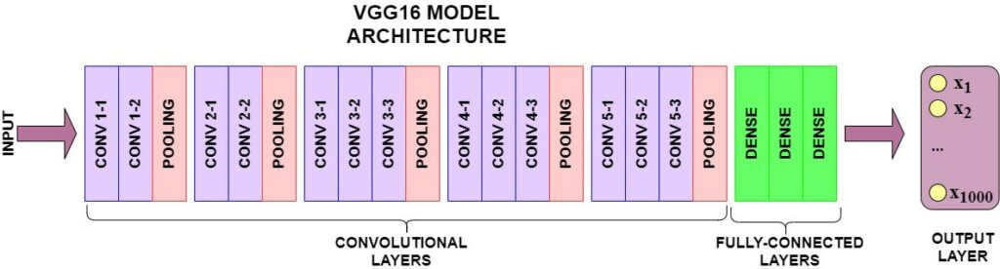

# vgg16-impl-img-classification

This repository is about the VGG16 algorithm implementation and perform image classification.



The VGG16 model contains 13 Convolution layers and 3 Dense layers. The architecture can be used for image classification problem.

```python

def VGG16(input_tensor=None, classes=2):

    model = Sequential()

    # Block1
    model.add(Conv2D(64, (3,3), activation='relu', padding='same', name='block1_conv1', input_shape=(300,300,3)))
    model.add(Conv2D(64, (3,3), activation='relu', padding='same', name='block1_conv2'))
    model.add(MaxPool2D((2,2), strides=(2,2), name='block1_maxpool'))

    # Block2
    model.add(Conv2D(128, (3,3), activation='relu', padding='same', name='block2_conv1'))
    model.add(Conv2D(128, (3,3), activation='relu', padding='same', name='block2_conv2'))
    model.add(MaxPool2D((2,2), strides=(2,2), name='block2_maxpool'))

    # Block3
    model.add(Conv2D(256, (3,3), activation='relu', padding='same', name='block3_conv1'))
    model.add(Conv2D(256, (3,3), activation='relu', padding='same', name='block3_conv2'))
    model.add(Conv2D(256, (3,3), activation='relu', padding='same', name='block3_conv3'))
    model.add(MaxPool2D((2,2), strides=(2,2), name='block3_maxpool'))


    # Block4
    model.add(Conv2D(512, (3,3), activation='relu', padding='same', name='block4_conv1'))
    model.add(Conv2D(512, (3,3), activation='relu', padding='same', name='block4_conv2'))
    model.add(Conv2D(512, (3,3), activation='relu', padding='same', name='block4_conv3'))
    model.add(MaxPool2D((2,2), strides=(2,2), name='block4_maxpool'))


    # Block5
    model.add(Conv2D(512, (3,3), activation='relu', padding='same', name='block5_conv1'))
    model.add(Conv2D(512, (3,3), activation='relu', padding='same', name='block5_conv2'))
    model.add(Conv2D(512, (3,3), activation='relu', padding='same', name='block5_conv3'))
    model.add(MaxPool2D((2,2), strides=(2,2), name='block5_maxpool'))

    # Block6
    model.add(Flatten(name="flatten"))
    model.add(Dense(4096, activation='relu', name='fc1'))
    model.add(Dropout(0.5))
    model.add(Dense(4096, activation='relu', name='fc2'))
    model.add(Dropout(0.5))
    model.add(Dense(classes, activation='softmax', name='prediction'))

    return model

```

The model contains 50% of accuracy and still needs to be improved.
